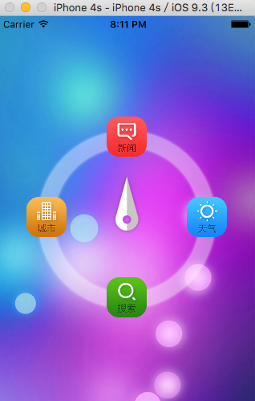
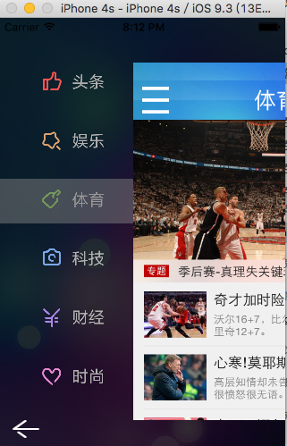
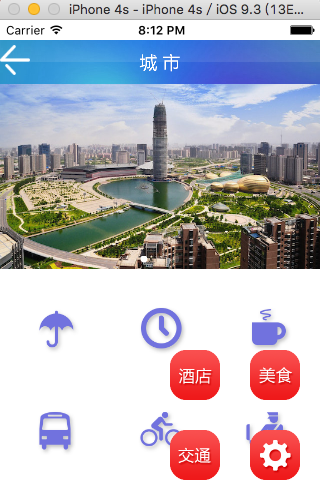
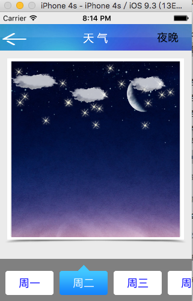
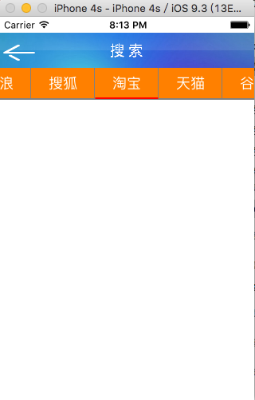

YiBaiLife
=========
   
这是一个在学习中实践的一个项目。实现了密码，首页，新闻，城市，天气，搜索等功能。数据是固定的，只是为了实现功能。

=========

###                     Author:Haven
###              E-mail:HavenMailBox@163.com

=========

##目录  
* [gif图片](#gif图片)  
* [密码界面](#密码界面)  
* [首页](#首页)  
* [新闻界面](#新闻界面)  
* [城市界面](#城市界面)  
* [天气界面](#天气界面)  
* [搜索界面](#搜索界面)  

*********  

gif图片
--------
 
使用[Licecap](http://www.cockos.com/licecap/)进行屏幕的录制。

========

密码界面
--------

   密码界面随机产生四个数字作为密码，然后点击下面的数字覆盖上面的数字进行解密。

首页
--------
  
   首页是一个旋转的动画，每点击一个按钮顺时针转动，并跳转至指定页面。

新闻界面
--------

城市界面
--------

天气界面
--------

   天气界面实现了周一到周日的天气（数据是固定的），同时也实现了白天和晚上的界面切换的功能。

搜索界面
--------

